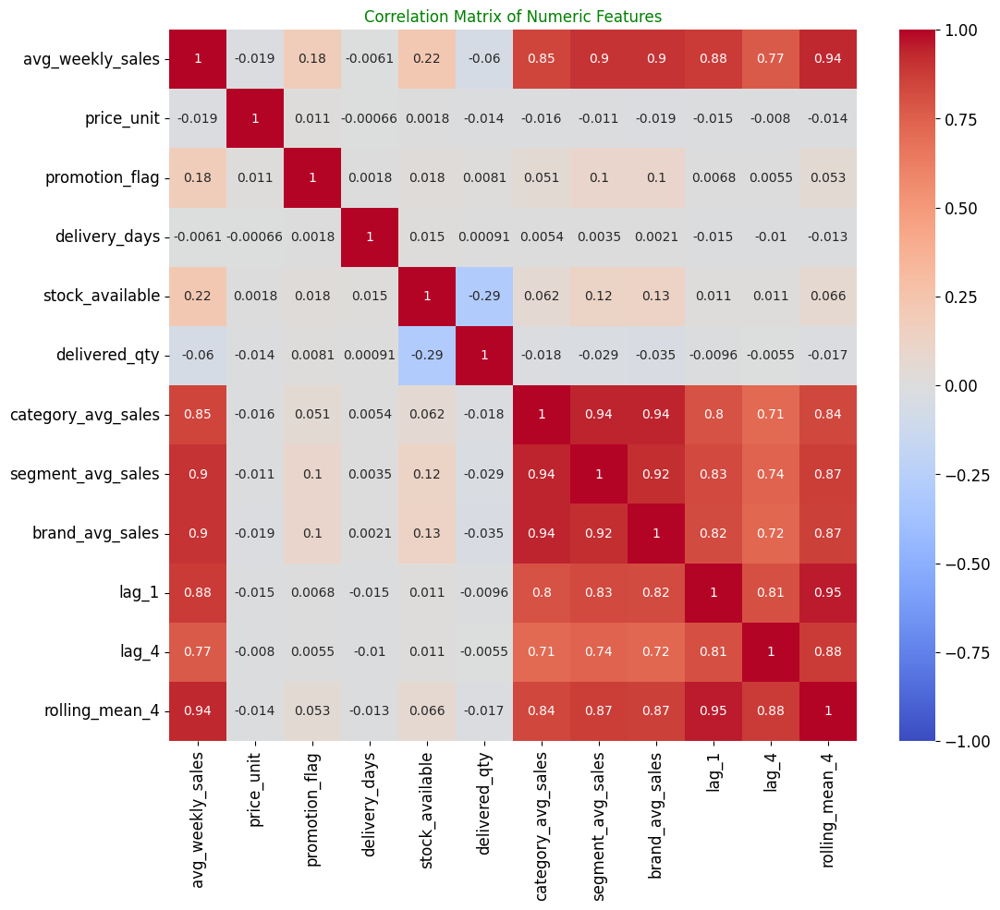
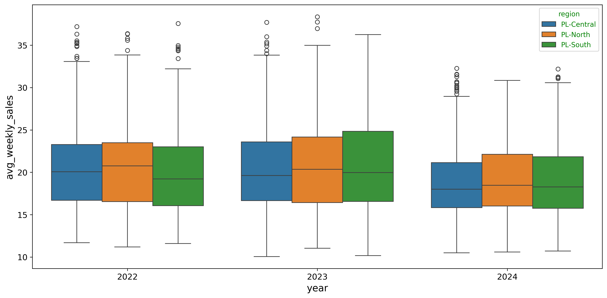
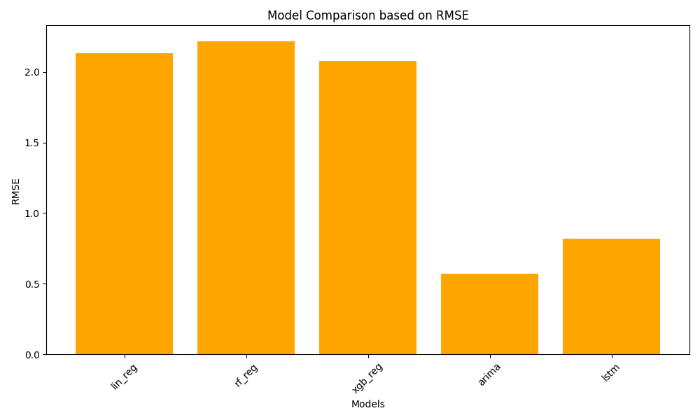
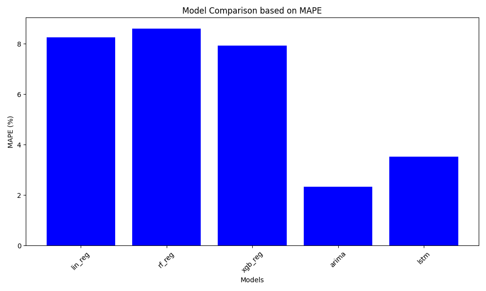
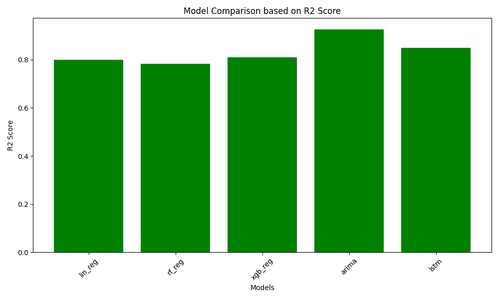
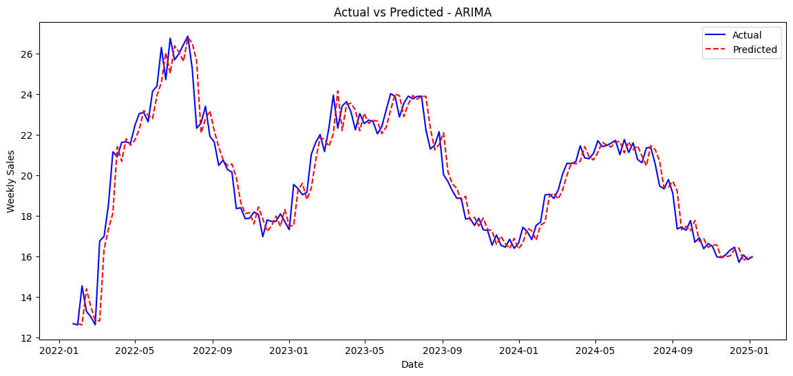
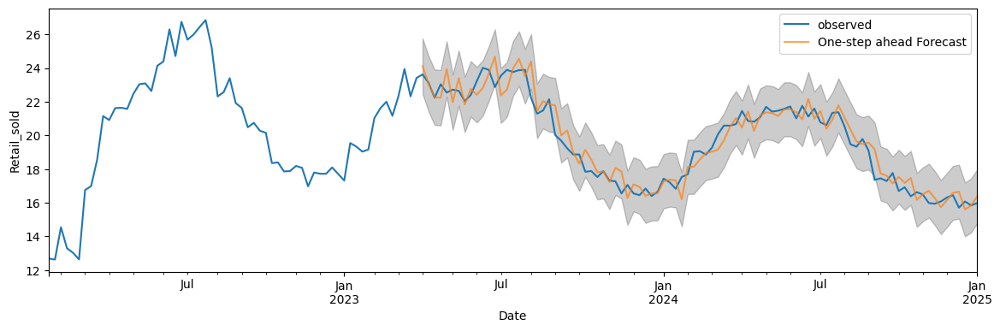
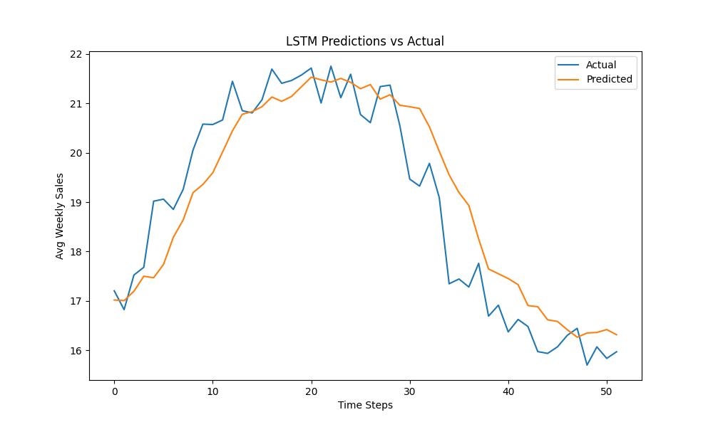
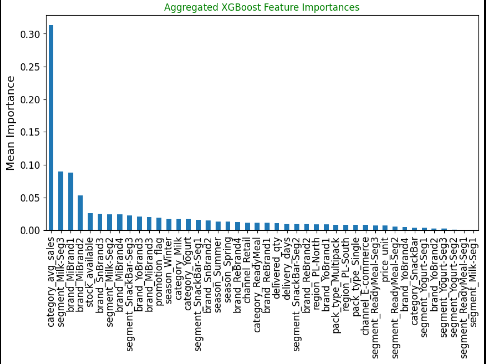

# TimeSeries_Analysis_Prediction

## Project Description

This project is a time series analysis and prediction pipeline for forecasting average weekly sales in an FMCG (Fast-Moving Consumer Goods) dataset. It processes daily sales data, aggregates it to weekly levels, performs feature engineering (including lag features, rolling means, seasonal encoding, and hierarchy averages), handles encoding and scaling, and evaluates multiple machine learning and time series models to identify the best performer based on metrics like R2, MAE, and MSE.

Key features:
- Data aggregation from daily to weekly per SKU.
- Feature engineering: Lags, rolling averages, seasonal indicators, one-hot encoding for categorical features, standard scaling, and correlation-based feature selection.
- Models evaluated: Linear Regression, Random Forest, XGBoost, ARIMA, and LSTM (deep learning for sequence modeling).
- Pipeline integration: A single `engine.py` script runs data processing, feature engineering, model training, evaluation, and comparison.
- Artifacts: Saves preprocessors, scalers, models, and processed data for reproducibility and inference.

The project is structured under `src/ML_Pipeline/` with modular scripts for each component, making it easy to extend or modify.

## Installation

### Python Version
This project requires Python 3.10 for compatibility with all dependencies.

### Creating a Virtual Environment and Installing Requirements

#### For Windows:
1. Open Command Prompt (Win + R, type "cmd", Enter).
2. Navigate to your project directory:
3. Create a virtual environment:
    * python -m venv ts_env
4. Activate it:
    * ts_env\Scripts\activate
5. Install requirements:
    * pip install -r requirements.txt


### For Linux/Mac:
O#### For Linux/Mac:
1. Open a terminal.
2. Navigate to your project directory: cd /path/to/TimeSeries_Analysis_Prediction
3. Create a virtual environment: python3.10 -m venv ts_env
4. Activate it: source ts_env/bin/activate
5. Install requirements:pip install -r requirements.txt


ariable.

## Execution Instructions if Multiple Python Versions Installed

If you have multiple Python versions, use `py -3.10` (Windows) or `python3.10` (Linux/Mac) to specify the version.

Note: Ensure Python 3.10 is installed and in your PATH. For TensorFlow on Mac (Intel), this setup works; for Apple Silicon, consider additional steps like `tensorflow-metal`.

## Usage

### Running the Pipeline
1. Activate your virtual environment (as above).
2. From the project root, run:


- This executes the full pipeline: data loading, aggregation, feature engineering, model training/evaluation, and comparison.
- Outputs: Model metrics (R2, MAE, MSE), best model identification, saved artifacts (e.g., models in `artifacts/`, processed data).

### Configurable Elements
- Edit `src/ML_Pipeline/config.py` for file paths (e.g., `DATA_FILEPATH`, `PROCESSED_DATA_FILEPATH`).
- For custom runs, modify `engine.py` (e.g., uncomment ARIMA tuning, adjust LSTM hyperparameters like `n_steps` or epochs).

## Project Structure

```text
TimeSeries_Analysis_Prediction/
├── src/                        
│   ├── engine.py                 # Main pipeline runner
│   ├── ML_Pipeline/
│   │   ├── config.py             # Configuration (paths, column names)
│   │   ├── dataset.py            # Data loading and aggregation
│   │   ├── Featureengineering.py # Feature creation, encoding, scaling
│   │   ├── regression_models.py  # ML models (Linear, RF, XGBoost)
│   │   ├── arima.py              # ARIMA model implementation
│   │   ├── lstm.py               # LSTM model implementation
│   │   └── ...                   # Other utils if added
│
├── input/                        # Raw input data (CSV files)
│   └── FMCG_2022_2024.csv
│
├── output/                       # Outputs from pipeline
│   ├── processed/                # Processed / cleaned data
│   │   └── processed_data.csv
│   └── models/              # Trained models (pickle files)
│     
│
├── images/                       # Plots and visualizations
│
├── notebooks/                    # Jupyter notebooks for experimentation
│
├── requirements.txt              # Dependencies
├── README.md                     # Project documentation
└── .gitignore                    # Ignored files (env, pycache, large data dumps)

``` 


## Models Used
- **Machine Learning**: Linear Regression, Random Forest, XGBoost (feature-based regression).
- **Time Series**: ARIMA (autoregressive integrated moving average for univariate forecasting).
- **Deep Learning**: LSTM (long short-term memory network for sequential data).

Models are evaluated on a test split, with ARIMA and LSTM applied to global weekly averages for simplicity.

## Visuals Recommendation
Yes, including visuals in your README or project would enhance it, especially for a time series analysis project. Here's what I suggest:

1. **Correlation Heatmap**: From feature engineering (already in code via seaborn.heatmap). Add a screenshot showing feature correlations to highlight multicollinearity removal.

Below is the correlation matrix of numeric features:



### Correlation Heatmap of Numeric Features
- **Strong Positive Correlations with Target**: `avg_weekly_sales` shows high positive correlations (0.77–0.94) with historical sales metrics like `category_avg_sales`, `segment_avg_sales`, `brand_avg_sales`, `lag-1`, `lag-4`, and `rolling_mean-4`, indicating past trends are key predictors.
- **Negative Price Impact**: A moderate negative correlation (-0.19) exists between `avg_weekly_sales` and `price_unit`, suggesting higher prices tend to reduce sales volume.
- **Inter-Feature Relationships**: Aggregated sales features (e.g., category, segment, brand) are highly correlated with each other (0.92–0.94), while `stock_available` and `delivered_qty` have a notable negative link (-0.29), highlighting potential supply chain dynamics.


2. **Sales Trends Plot**: Plot weekly sales over time (e.g., using matplotlib or seaborn in a notebook). This visualizes seasonality or trends in the data.

### Box Plot of Average Weekly Sales by Region and Year (Poland)
- **Upward Trend Across Years**: Median sales increased steadily from ~20 units in 2022 to 22–25 units in 2024 for all regions, with the strongest growth in South (green) and North (orange) regions.
- **Regional Variations**: Central (blue) had the most outliers (high-sales spikes) in 2022–2023, East (purple) showed the lowest and most stable medians, while interquartile ranges indicate moderate variability overall.
- **Outlier Insights**: Sporadic high performers (circles) are more common in Central and North, pointing to occasional demand surges, but no extreme lows across regions.


* So, on average Yogurt and ReadMeal  are more sales than other categor.


* Overall PL-Central region has more sales

3. **Model Performance Comparison**: Bar chart of MSE/R2 across models (generate via matplotlib.bar in engine.py or a separate script).


### RMSE Comparison
* ARIMA has the lowest MSE (~0.5), then LSTM (~1.0), while regressions range ~4.0–4.5, underscoring ARIMA's strength in minimizing absolute errors for demand prediction.


### MAPE Comparison
* ARIMA excels with ~2.5% MAPE, far below others (~7–8.5%), highlighting its superiority for relative sales forecasting accuracy.


### R² Score Comparison
* All models show strong R² scores (0.78–0.90), with ARIMA and LSTM leading at ~0.90, followed by XGBoost (~0.82), indicating time-series models best capture sales variance.

4. **Forecast vs Actual Plot**: For ARIMA/LSTM, plot predictions vs test data to show forecasting accuracy.
## ARIMA VS SARIMA

## SARIMA


### LSTM Prediction Values


5. **Feature Importance**: For XGBoost/RF, plot top features (using model.feature_importances_).

### Feature Importance
- **Dominant Historical Sales Features**: Category and segment-level average sales (e.g., `category_segment_avg_sales3` at ~0.30) lead in importance, followed by brand-segment lags (~0.10–0.15), emphasizing aggregated past performance as key predictors over individual granular details.
- **Secondary Influences**: Promotion, season, and channel features show moderate importance (~0.02–0.05), while specific product attributes like pack_type and delivery_days contribute minimally, suggesting broader trends outweigh operational variables.
- **Low Granularity Impact**: Numerous brand-specific features (e.g., Milk, Yogurt variants) hover near 0.00–0.01, indicating XGBoost prioritizes high-level groupings for efficient sales forecasting.

To include:
- Run code to generate images (e.g., save with plt.savefig('visuals/corr_heatmap.png')).
- Add to README: ``
- Create a `visuals/` folder and commit the images (or generate them dynamically in a Jupyter notebook for demo).

This makes the project more engaging and demonstrates results visually.

## Contributing
Feel free to fork and submit pull requests. Ensure tests pass and follow Python PEP8 style.

## License
MIT License (or specify your own).